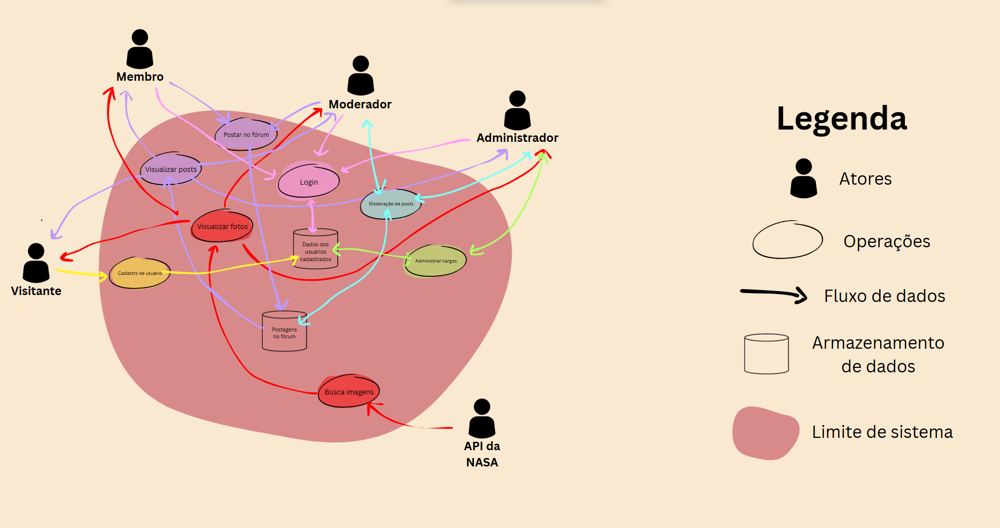

# Rich Picture

## Introdução

Rich Picture é uma técnica de representação visual que utiliza desenhos e elementos gráficos para expressar de maneira sistêmica cenários e situações complexas que não possuem uma única solução. Essa abordagem permite ilustrar diferentes perspectivas sobre um mesmo problema, facilitando a compreensão de diversas questões.

No Projeto Planetário Virtual, os rich pictures foram utilizados já nas primeiras etapas para mapear as diferentes visões do projeto. Cada integrante da equipe criou sua própria representação gráfica, destacando aspectos que considerava relevantes. Em seguida, todos os desenhos foram compartilhados e discutidos em grupo, permitindo uma troca de ideias mais dinâmica. Por fim, foi realizada uma votação para definir a versão oficial do rich picture, consolidando as perspectivas mais alinhadas aos objetivos do projeto e garantindo um entendimento comum entre os participantes.

## Versão final

| Data | Autor(es) | Descrição | Versão |
|------|-------|-----------|--------|
| 10/04/2025 | Raphaela Guimarães | Cria a página e adiciona Rich Picture | 1.0 |