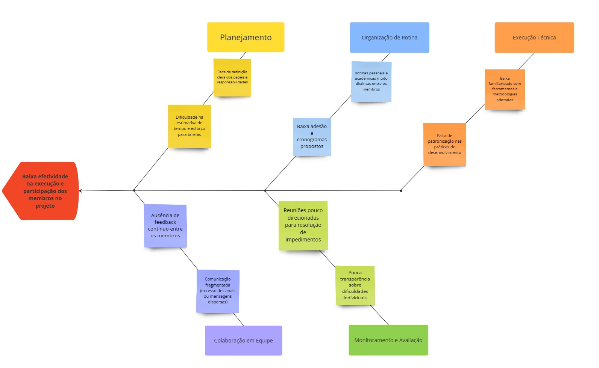
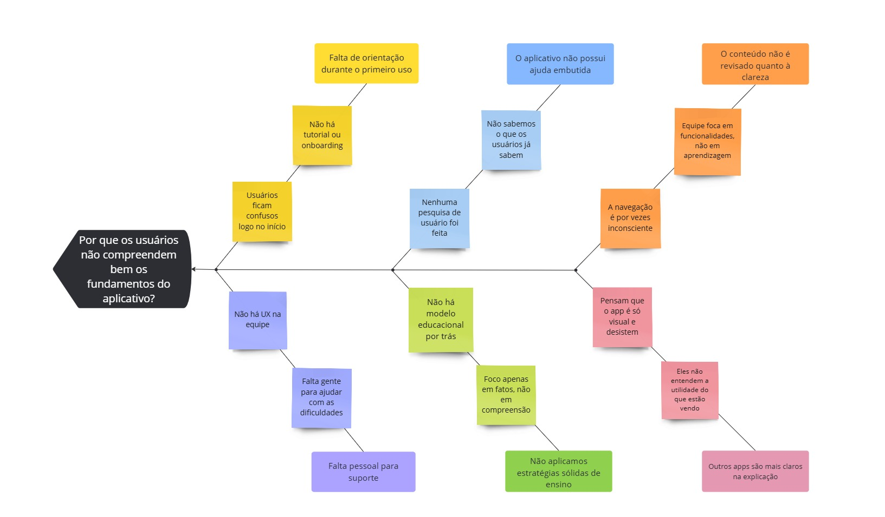

# Diagrama de Causa e Efeito 

## Introdução

O **Diagrama de Causa e Efeito**, também conhecido como **Diagrama de Ishikawa** ou **Espinha de Peixe**, é uma técnica utilizada para identificar as possíveis causas de um problema específico, organizando-as de forma categorizada. Seu uso é essencial em processos de melhoria contínua, pois permite compreender a origem de falhas e gargalos em projetos e sistemas.

No contexto do projeto **Planetário Virtual**, este diagrama foi aplicado para entender os fatores que poderiam comprometer o desenvolvimento do projeto, desde aspectos técnicos até questões relacionadas ao conteúdo. Com isso, torna-se possível propor ações preventivas ou corretivas durante o semestre.

## Metodologia

A construção do Diagrama de Causa e Efeito foi realizada de forma colaborativa, utilizando a ferramenta **Miro** para  permitir edição e visualização por todos os autores .As causas levantadas foram classificadas de acordo com categorias **adaptadas** do modelo dos 6Ms (Método, Máquina, Mão de Obra, Material, Meio Ambiente e Medição), resultando em uma estrutura clara e objetiva.
 

## Diagrama de Causa e Efeito

A seguir, nas **Figuras 1 e 2**, são apresentados os diagramas desenvolvidos para o projeto.

### Baixa efetividade na execução e participação dos membros no projeto

<b>Figura 1:</b> Diagrama de Causa e Efeito — Baixa efetividade na execução e participação dos membros no projeto.

 

<b>Autor:</b> [Milena Rocha](https://github.com/MilenaFRocha) e [Rafael Pereira](https://github.com/rafgpereira), 2025.

---

### Compreensão do aplicativo

<b>Figura 2:</b> Diagrama de Causa e Efeito — Compreensão do aplicativo.

 

<b>Autor: [Letícia Martins](https://github.com/leticiatmartins) e [Manoel Castro](https://github.com/manoelmoura)</b> , 2025.

---

## Bibliografia

>AMERICAN SOCIETY FOR QUALITY. Fishbone Diagram (Cause and Effect Diagram). Disponível em: https://asq.orgquality-resources/fishbone. Acesso em: 9 abr. 2025.

---

### Histórico de Versão

| Versão | Data       | Descrição              | Autor                                           | Revisor                                       |
|--------|------------|------------------------|--------------------------------------------------|-----------------------------------------------|
| 1.0    | 07/04/2025 | Criação do documento   | [Milena Rocha](https://github.com/milenafrocha) | [Rafael Pereira](https://github.com/rafgpereira) |

