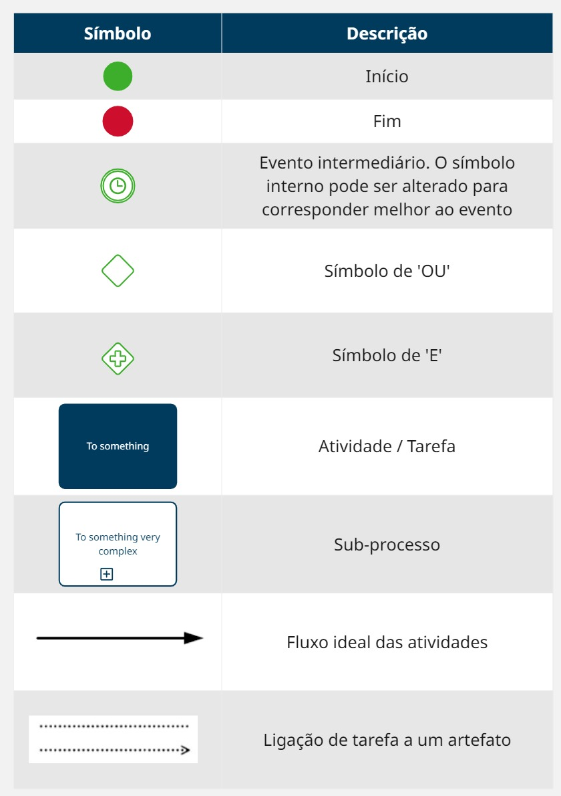

# Modelagem BPMN 

## Introdução

O desenvolvimento do projeto **Planetário Virtual** será conduzido com base nas metodologias ágeis, pois essas metodologias surgiram com a proposta de fornecer agilidade de resposta e flexibilidade de adaptação ao longo do processo de desenvolvimento, promovendo um diferencial competitivo por meio da velocidade e da qualidade dos resultados 1. Assim, buscamos um maior aproveitamento do tempo e de toda a equipe.

## Metodologias

A metodologia adotada para o desenvolvimento do projeto **Planetário Virtual** será uma combinação das abordagens ágeis **Scrum**, **Kanban**, **XP (Extreme Programming)** e **Crystal**, reunindo o melhor de cada uma para tornar o processo mais **eficiente**, **colaborativo** e **adaptável**.

### Scrum

O **Scrum**2 será utilizado para organizar o trabalho em **sprints**, que são ciclos curtos com duração determinada.  
Cada sprint corresponderá a uma **entrega prevista no plano de ensino**, garantindo que o projeto evolua de forma alinhada aos marcos acadêmicos.

Ao final de cada sprint, realizaremos uma **reunião de revisão (review)** para apresentação dos resultados, avaliação do que foi entregue e coleta de **feedbacks** para melhorias nas próximas entregas.

A partir da **segunda sprint**, utilizaremos o **Planning Poker**, uma técnica colaborativa que permite estimar o esforço necessário para cada tarefa, promovendo decisões mais justas e engajamento da equipe no planejamento.

O papel de **Scrum Master** será exercido por **Rafael**, responsável por **facilitar os processos**, **remover impedimentos** e garantir que a equipe esteja seguindo corretamente os princípios do Scrum.

### XP

A metodologia **XP**4 será utilizada para garantir a **qualidade técnica** do projeto, com foco em práticas colaborativas. Destacamos duas principais:

- **Testes constantes**: todas as funcionalidades serão testadas desde o início do desenvolvimento, reduzindo falhas e retrabalho.
- **Programação em pares**: sempre que possível, dois membros da equipe desenvolverão juntos, promovendo **troca de conhecimento** e **aprendizado contínuo**.

### Kanban

A metodologia **Kanban**3 será adotada como uma ferramenta **visual** para controle e acompanhamento do fluxo de trabalho.  
Utilizaremos um **repositório no Git**, onde:

- Cada tarefa é registrada como uma **issue**;
- Cada issue é atribuída a um **responsável**;
- O **status** de cada tarefa é atualizado conforme sua etapa:

  - **Backlog** → pendente  
  - **To Do** → a fazer  
  - **In Progress** → em andamento  
  - **Done** → concluída

Essa organização permite uma gestão **transparente**, **objetiva** e **visual**, facilitando a comunicação entre os membros, o acompanhamento contínuo das entregas e evitando sobrecargas de trabalho.

### Crystal

A abordagem **Crystal**5 será aplicada para garantir **flexibilidade** e uma **comunicação leve e eficaz**.  
Essa metodologia adapta-se às **características específicas da equipe**, incentivando relacionamentos diretos e colaborativos.

As **discussões e alinhamentos** do grupo acontecem de forma mais **informal** e **fluida**, principalmente por meio do **Microsoft Teams** e do **WhatsApp**, canais que usamos diariamente para decisões rápidas e comunicação constante, sem burocracia.

## Modelagem BPMN

Nesse documento, o fluxo de trabalho do projeto será organizado de acordo com uma adaptação do modelo Business Process Model and Notation (BPMN). Em nosso projeto, esse modelo consiste em organizar os processos em piscinas (pools) contendo as atividades que serão realizadas em cada etapa do projeto para cada metodologia utilizada, como descrito acima. Além disso, verticalmente são distribuidas as etapas do projeto, para melhor compreensão temporal das tarefas. Todos os elementos utilizados para a concepção dos artefatos bem como os conectores que os ligam são detalhados abaixo na **Figura 1**.

**Figura 1:** Legenda Modelagem BPMN

**Autor:** [Rafael Pereira](https://github.com/rafgpereira), 2025.

---

> Abaixo, são apresentadas as piscinas para o princípio adotado de cada uma das metodologias.

### Scrum

Na **Figura 2** é exibida a piscina do SCRUM, que é a metologia principal que guiará o fluxo base do projeto.

**Figura 2:** Piscina do SCRUM

**Autores:** [Milena Rocha](https://github.com/MilenaFRocha), [Rafael Pereira](https://github.com/rafgpereira) e [João Lucas Araújo](https://github.com/jlucasiqueira), 2025.

---

### XP

Na **Figura 3** apresenta-se a abordagem que será utilizada mesclando o XP com o SCRUM, dando foco para a implementação de **testes** e a **programação em pares**, cujas piscinas serão exibidas na **Figura 4** e **Figura 5**, respectivamente.

**Figura 3:** Piscina do XP

**Autor:** [Taynara Gabrielle Vitorino](https://github.com/taybalau), 2025.

---

**Figura 4:** Piscina dos Testes do XP

**Autor:** [Letícia Martins](https://github.com/leticiatmartins), 2025.

---

**Figura 5:** Piscina da Programação em Pares do XP

**Autor:** [Manoel Moura](https://github.com/manoelmoura), 2025.

---

### Kanban

Na **Figura 6** é apresentada a piscina da metodologia kanban, que será destrinchada e utilizada para gerenciar o backlog do produto e das sprints (gerenciamento de issues).

**Figura 6:** Piscina do Kanban

**Autores:** [Raphaela Guimarães](https://github.com/raphaiela) e [Antônio José](https://github.com/antonioleaojr), 2025.

---

### Crystal

Na **Figura 7** apresenta-se a utilização da metodologia Crystal em nosso projeto: a comunicação, que tem por características ser simples, rápida, amgável e eficaz.

**Figura 7:** Piscina da Crystal

**Autores:** [Carlos Paz](https://github.com/dudupaz) e [João Pedro Silva](https://github.com/JoaoPedrooSS), 2025.

---

## Referências Bibliográficas

>1.  MORAES, Marcelo de Carvalho. *Aplicação de metodologias ágeis no gerenciamento de projetos de software*. 2009. 103 f. Monografia (Graduação em Engenharia de Produção) – Departamento de Engenharia Industrial, Pontifícia Universidade Católica do Rio de Janeiro, Rio de Janeiro, 2009. Disponível em: <https://www.maxwell.vrac.puc-rio.br/15760/15760_3.PDF>. Acesso em: 11 abr. 2025.
>
>2.  CNN Brasil. **Metodologia Scrum: o que é, princípios e como funciona**. Disponível em: <https://www.cnnbrasil.com.br/tecnologia/scrum/>. Acesso em: 11 abr. 2025.
>
>3.  PM3. **Kanban: o que é, como funciona e aplicação em produto**. Disponível em: <https://pm3.com.br/blog/kanban-o-que-e-como-funciona-e-aplicacao-em-produto/>. Acesso em: 11 abr. 2025.
>
>4.  Sydle. **Extreme Programming: o que é e como funciona?** Disponível em: <https://www.sydle.com/br/blog/extreme-programming-602ee205da4d096809438c9c>. Acesso em: 11 abr. 2025.
>
>5.  Runrun.it. **Metodologia Crystal: o que é, variações e como aplicar**. Disponível em: <https://blog.runrun.it/metodologia-crystal/>. Acesso em: 11 abr. 2025.

### Histórico de Versões

| Versão | Data       | Descrição                                      | Autor               | Revisor            |
|--------|------------|------------------------------------------------|---------------------|--------------------|
| 1.0    | 11/04/2025 | Criação do documento | [Milena Rocha](https://github.com/milenafrocha)          |  [João Lucas](https://github.com/jlucasiqueira)  |
| 1.1    | 11/04/2025 | Inserção dos artefatos produzidos | [Rafael Pereira](https://github.com/rafgpereira)  |  [Manoel Moura](https://github.com/manoelmoura)   |