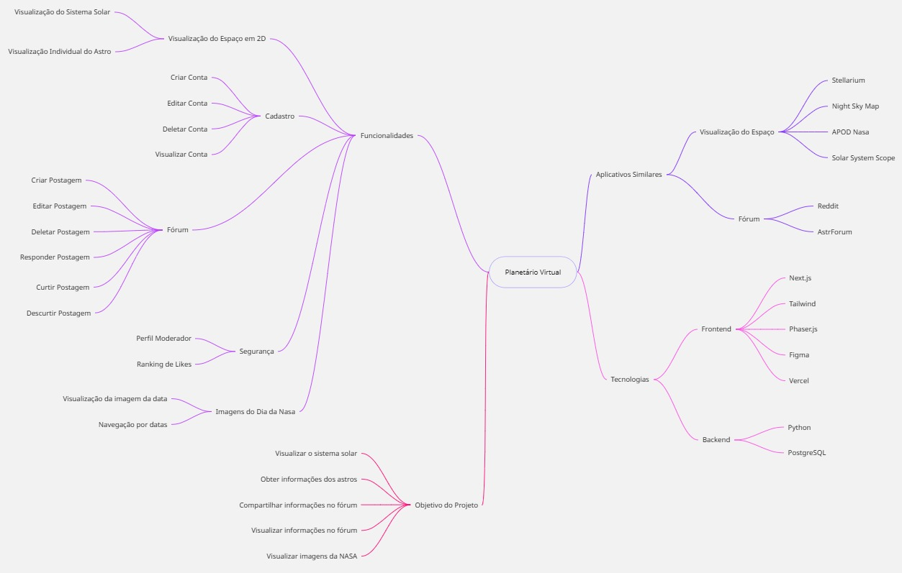

# 1.1.1. Mapa Mental

## Introdução

O Mapa Mental é uma ferramenta inicial poderosa para dar o pontapé no desenvolvimento de um projeto. Ele permite estruturar ideias e conceitos de forma visual, clara e organizada, ajudando na formação da concepção inicial do sistema ou solução a ser criada.

Mais do que apenas um esboço, o mapa mental é um artefato iterativo que evolui ao longo do tempo, apoiando a equipe na organização das informações, planejamento, brainstormings, e na identificação de soluções criativas e eficientes. Ele mapeia os conceitos principais e suas ramificações.

Para o Planetário Virtual, o mapa mental contribui para visualizar funcionalidades e tecnologias envolvidas, sendo uma base sólida para futuras decisões e desenvolvimentos técnicos

## Metodologia
A construção do mapa mental seguiu uma abordagem colaborativa. Inicialmente, foi realizada uma reunião presencial em sala de aula, onde ocorreu uma sessão de brainstorming para levantar ideias relacionadas ao projeto. As contribuições foram organizadas por temas e, posteriormente, estruturadas na plataforma Miro.

O link do mapa foi compartilhado via WhatsApp, permitindo a edição e participação de todos os integrantes. Após as contribuições, o material passou por uma revisão final, resultando em um mapa mental coeso e representativo da concepção inicial do projeto, como pode ser visualizado na **Figura 1** abaixo.

## Artefato produzido

**Figura 1:** Mapa Mental Planetário Virtual

**Autores:** Todos os integrantes, 2025.

## Referências

> LUCIDCHART. *O que é um mapa mental e como fazer um*. Disponível em: <https://www.lucidchart.com/pages/pt/o-que-e-mapa-mental-e-como-fazer>. Acesso em: 7 abr. 2025.

### **Histórico de Versão**

| Versão | Data       | Descrição                                      | Autor               | Revisor            |
|--------|------------|------------------------------------------------|---------------------|--------------------|
| 1.0    | 05/04/2025 | Criação do documento | [Milena Rocha](https://github.com/milenafrocha)          |  [Rafael Pereira](https://github.com/rafgpereira)  |