# Rich Pictures

## Introdução

O rich picture é uma ferramenta visual que facilita a expressão de ideias e a análise de problemas de maneira simples e informal. Na engenharia de software, ele é usado para representar, de forma abstrata, o funcionamento de sistemas de software. Apresenta-se como um diagrama com elementos essenciais, incluindo atores, operações, armazenamento de dados, setas e os limites do sistema.

## Metodologia

Todos os integrantes elaboraram seu próprio rich picture com base na perspectiva que tinham da aplicação, após o desenvolvimento do mapa mental. Os rich pictures foram desenvolvidos em plataformas online de desenho e planejamento. 
Todos os rich pictures apresentados abaixo seguem a estrutura padrão com cinco elementos, os quais são explicitados na Figura 1 abaixo.

**Figura 1:** Elementos do Rich Picture

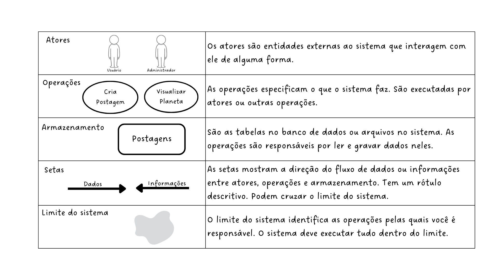

**Autor:** [Rafael Pereira](https://github.com/rafgpereira), 2025.

Em seguida, apresenta-se os 10 rich pictures produzidos pelos integrantes.

## Artefatos produzidos

---

<b>Antônio Júnior</b>

**Figura 2:** Rich Picture Antônio Júnior

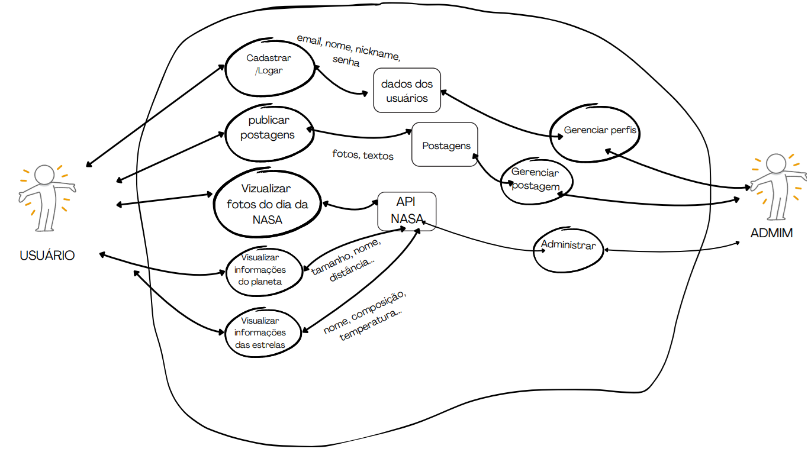

**Autor:** [Antônio Júnior](https://github.com/antonioleaojr), 2025.

---

<b>Carlos Eduardo</b>

**Figura 3:** Rich Picture Carlos Eduardo

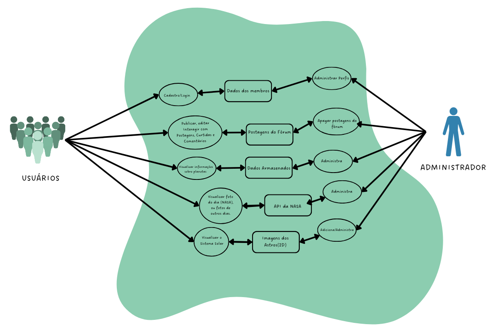

**Autor:** [Carlos Eduardo](https://github.com/dudupaz), 2025.

---

<b>João Lucas</b>

**Figura 4:** Rich Picture João Lucas

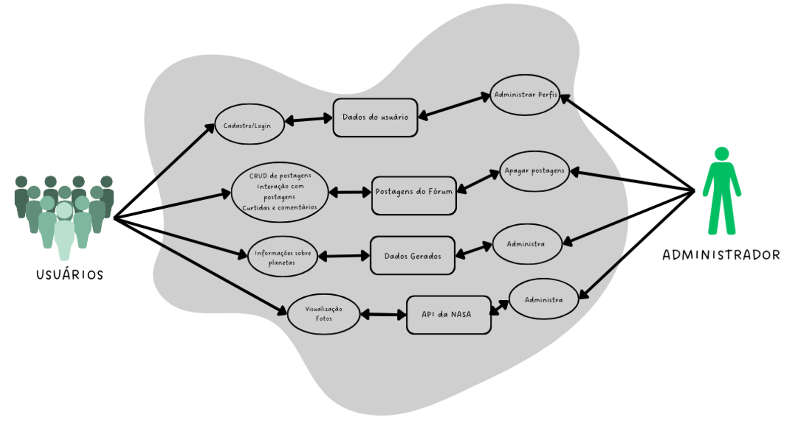

**Autor:** [João Lucas](https://github.com/jlucasiqueira), 2025.

---

<b>João Pedro</b>

**Figura 5:** Rich Picture João Pedro

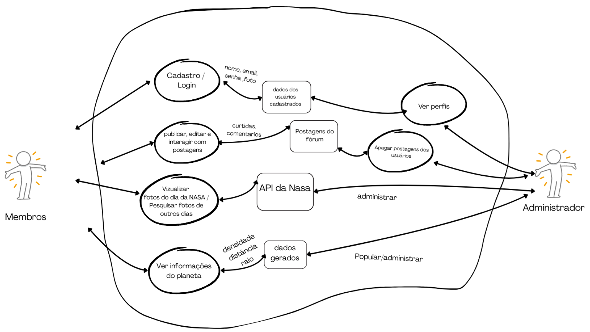

**Autor:** [João Pedro](https://github.com/JoaoPedrooSS), 2025.

---

<b>Letícia Torres</b>

**Figura 6:** Rich Picture Letícia Torres

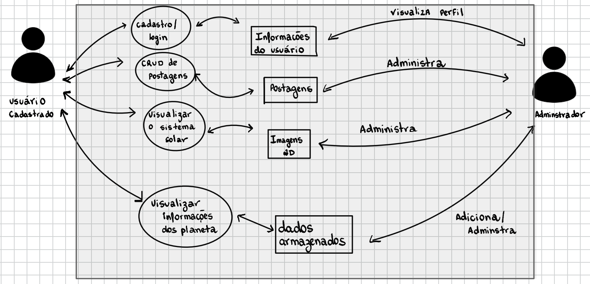

**Autor:** [Letícia Torres](https://github.com/leticiatmartins), 2025.

---

<b>Manoel Castro</b>

**Figura 7:** Rich Picture Manoel Castro

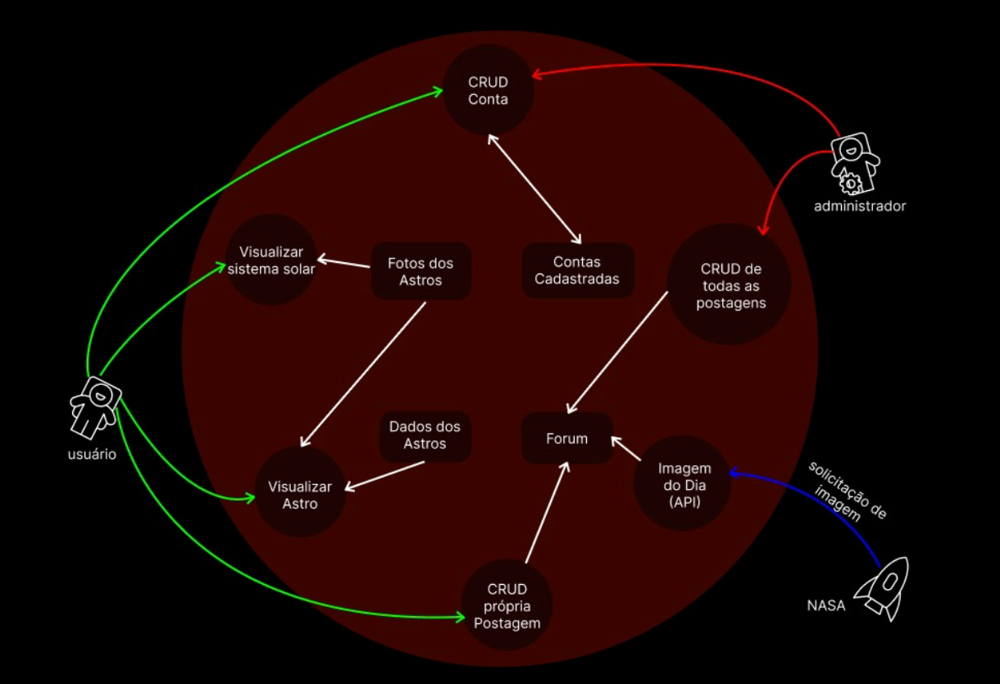

**Autor:** [Manoel Castro](https://github.com/manoelmoura), 2025.

---

<b>Milena Rocha</b>

**Figura 8:** Rich Picture Milena Rocha

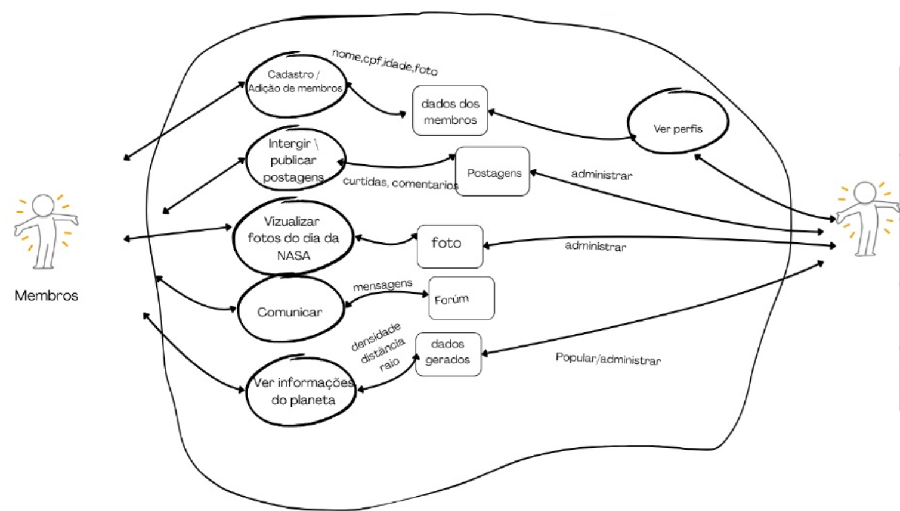

**Autor:** [Milena Rocha](https://github.com/MilenaFRocha), 2025.

---

<b>Rafael Pereira</b>

**Figura 9:** Rich Picture Rafael Pereira

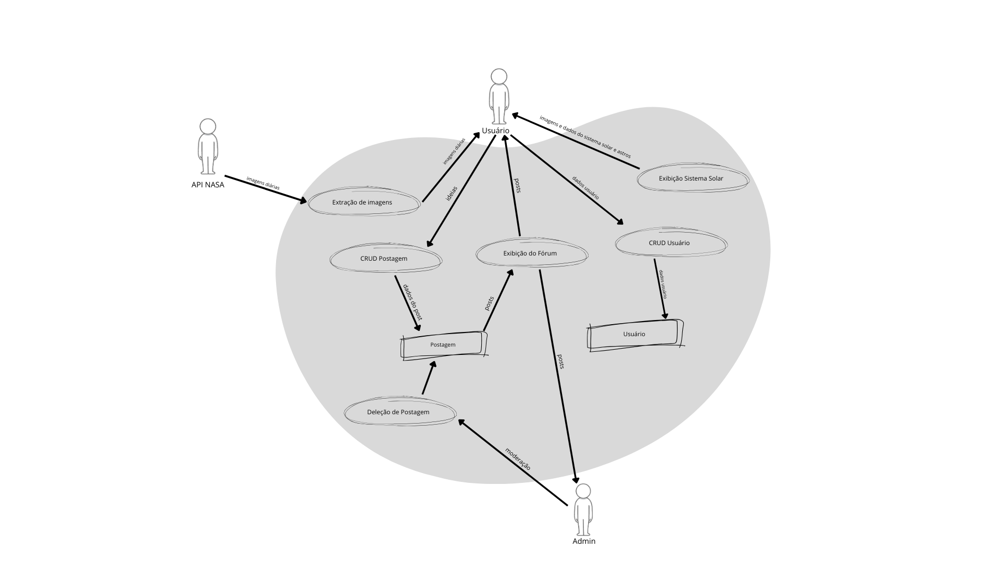

**Autor:** [Rafael Pereira](https://github.com/rafgpereira), 2025.

---

<b>Raphaela Guimarães</b>

**Figura 10:** Rich Picture Raphaela Guimarães

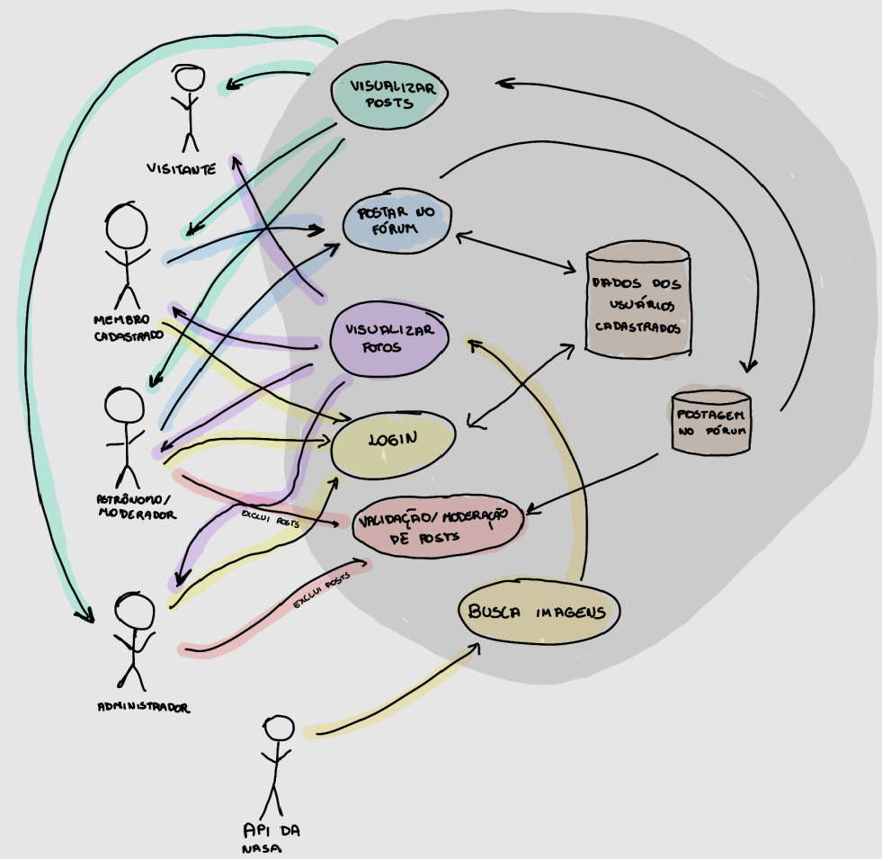

**Autor:** [Raphaela Guimarães](https://github.com/raphaiela), 2025.

---

<b>Taynara Gabrielle</b>

**Figura 11:** Rich Picture Taynara Gabrielle

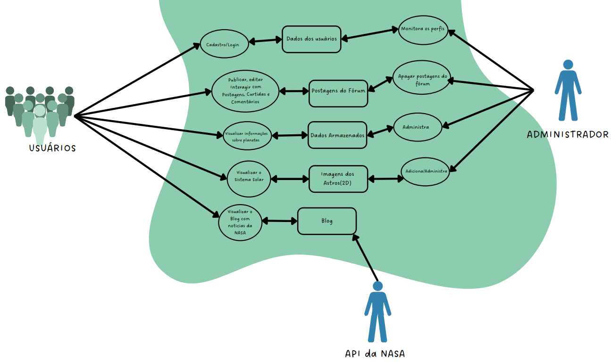

**Autor:** [Taynara Gabrielle](https://github.com/taybalau), 2025.

---

## Bibliografia

> CTEC2402 Software Development Project - Introducing Rich Pictures. Acesso em: 07/04/2025.

### **Histórico de Versão**

| Versão | Data       | Descrição                                      | Autor               | Revisor            |
|--------|------------|------------------------------------------------|---------------------|--------------------|
| 1.0    | 08/04/2025 | Criação do documento | [Rafael Pereira](https://github.com/rafgpereira)   |  [Milena Rocha](https://github.com/milenafrocha)  |
| 1.1    | 08/04/2025 | Adição dos Rich Pictures individuais. | [Rafael Pereira](https://github.com/rafgpereira)   |  [Milena Rocha](https://github.com/milenafrocha)  |