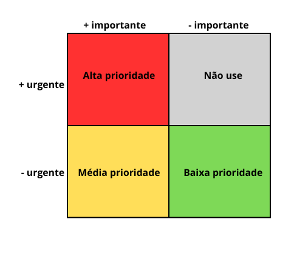

# Priorização Tree Level Scale

## Introdução

A priorização de requisitos é uma etapa essencial no processo da elicitação, pois ajuda a definir quais funcionalidades são mais importantes para o sucesso do projeto, orientando o planejamento e a alocação de recursos.

A técnica de priorização _Three Level Scale_1 é uma abordagem comum para priorizar requisitos, que agrupa-os em três categorias. Essas categorias geralmente são: **alta**, **média** e **baixa** prioridade. Entretanto, como aplicar essa escala pode ser uma tarefa subjetiva, que gera diferentes interpretações, as partes devem conversar e decidir uma forma de avaliação padrão.

## Metodologia

Para padronizar a abordagem e deixá-la útil, o integrante [Rafael Pereira](https://github.com/rafgpereira) estudou uma análise em duas dimensões: **importância** e **urgência**, definida por WIEGERS e BEATTY1. Dessa forma, os requisitos avaliados como urgentes e importantes tem alta prioridade, os menos urgentes mas ainda importantes tem média prioridade, e os menos importantes e menos urgentes são de baixa prioridade. Destaca-se que, nesse método, os que são avaliados como urgentes mas não tão importantes são considerados inúteis ou de baixa prioridade, já que muito provavelmente houve algum interesse pessoal de quem está priorizando, e, portanto, não são importantes. Veja na **Figura 1** a distribuição das prioridades no quadro de duas dimensões.

    <b>Figura 1:</b> Three Level Scale bidimensional.

<b>Autor:</b> <a href="https://github.com/rafgpereira">Rafael Pereira</a>, 2025.

---

Para priorizar os requisitos utilizando essa metodologia, o integrante [Rafael Pereira](https://github.com/rafgpereira) convidou a usuária Bruna Oliveira, explicou-a como funciona esse processo de priorização, como mostra a **Tabela 1**, e então mediou uma sessão de priorização com a usuária listando todos os requisitos elicitados, e obetiveram-se os resultados exibidos abaixo.

<b>Tabela 1:</b> Reunião de Priorização

| **Data**  | **Hora** | **Entrevistador** | **Entrevistado**             | **Duração** | **Local**                      |
|----------|--|--------------------|------------------------------|-------------|---------------------------------|
| 09/04/2025 | 11:30 | [Rafael Pereira](https://github.com/rafgpereira)    | Bruna Oliveira   |       | Virtual (Teams)  |

<b>Autor:</b> [Rafael Pereira](https://github.com/rafgpereira), 2025.

---

## Resultados

A Tabela 2 exibida a seguir exibe o resultado da sessão de priorização realizada com a usuária Denise, que classificou os requisitos em Alta, Média e Baixa prioridade conforme a metodologia descrita acima. Para visualizar na íntegra todo o processo, acesse o vídeo disponibilizado no fim da página.

<b>Tabela 2</b> - Requisitos funcionais e não funcionais priorizados

 

| ID    | Descrição                                                                                                     | Prioridade |
|-------|---------------------------------------------------------------------------------------------------------------|------------|
| **Requisitos Funcionais**                                                                                            |             |
| RF01  | O sistema deve exibir a *Foto do Dia* da NASA, com título, descrição e créditos.                             |      Baixa      |
| RF02  | O sistema deve apresentar curiosidades sobre o sistema solar de forma interativa.                            |      Baixa      |
| RF03  | O sistema deve permitir ao usuário visualizar informações detalhadas sobre os planetas (ex: massa, composição, distância do sol). |     Alta       |
| RF04  | O sistema deve exibir uma visualização 2D do sistema solar com qualidade e detalhes.                         |      Alta      |
| RF05  | O sistema deve permitir aplicar **zoom** na visualização do sistema solar.                                   |      Alta      |
| RF06  | O sistema deve permitir **clicar nos planetas** para exibir curiosidades e informações.                      |      Média      |
| RF07  | O sistema deve exibir órbitas, eixos e rotação dos planetas.                                                 |      Baixa      |
| RF08  | O sistema deve exibir imagens ilustrativas e fotos reais dos planetas e do espaço.                           |      Alta      |
| RF09  | O sistema deve permitir salvar ou compartilhar imagens exibidas.                                             |      Baixa      |
| RF10  | O sistema deve exibir a fonte das imagens (ex: NASA, ESA).                                                   |      Alta      |
| RF11  | O sistema deve fornecer um fórum para que os usuários compartilhem ideias e dúvidas sobre astronomia.        |      Alta      |
| RF12  | O sistema deve permitir **criar** postagens no fórum.                                                        |      Alta      |
| RF13  | O sistema deve permitir **ler** postagens e comentários de outros usuários.                                  |     Alta       |
| RF14  | O sistema deve permitir **atualizar** suas próprias postagens.                                               |      Baixa      |
| RF15  | O sistema deve permitir **deletar** suas próprias postagens.                                                 |       Alta     |
| RF16  | O sistema deve permitir aos usuários visualizar, criar, responder e curtir postagens no fórum.               |    Alta        |
| RF17  | O sistema deve organizar o fórum em categorias como "Planetas", "Descobertas" e "Astronomia para Leigos".   |      Média      |
| RF18  | O sistema deve permitir que usuários sinalizem postagens.                                                    |     Alta       |
| RF19  | O sistema deve permitir que usuários se cadastrem e personalizem seu perfil.                                 |       Baixa     |
| RF20  | O sistema deve permitir notificar o usuário sobre novos conteúdos e atividades no fórum.                     |      Média      |
| RF21  | O sistema deve apresentar uma seção de **notícias**, **eventos** ou **curiosidades** sobre astronomia.       |      Baixa      |
| RF22  | O sistema deve apresentar conteúdos atualizados sobre novas descobertas espaciais.                           |       Alta     |
| RF23  | O sistema deve apresentar um mapeamento de estrelas ou galáxias.                                             |      Alta      |
| **Requisitos Não-Funcionais**                                                                                        |            |
| RNF01 | O sistema deve possuir uma interface intuitiva e acessível para todas as idades.                             |     Alta       |
| RNF02 | A interface do sistema deve ser **intuitiva**, com nível de complexidade moderado.                           |       Alta     |
| RNF03 | A linguagem utilizada no sistema deve ser acessível, com termos científicos quando apropriado.              |     Alta       |
| RNF04 | O sistema deve estar disponível 24 horas por dia, com alta disponibilidade.                                  |     Média       |
| RNF05 | O sistema deve ter tempo de resposta inferior a 2 segundos para exibição das imagens da NASA.               |     Baixa       |
| RNF06 | O fórum deve garantir a segurança dos dados dos usuários, incluindo autenticação para CRUD.                  |      Alta      |
| RNF07 | O sistema deve manter os **dados dos usuários seguros**, especialmente no fórum.                             |       Alta     |
| RNF08 | O sistema deve estar disponível em múltiplas plataformas (desktop e mobile).                                 |      Alta      |
| RNF09 | O sistema deve ser compatível com **celular**, **tablet** e **PC**.                                          |      Alta      |
| RNF10 | O sistema deve garantir **acessibilidade**, incluindo suporte a leitores de tela e modo escuro.              |      Alta      |
| RNF11 | As informações científicas devem estar atualizadas e baseadas em fontes confiáveis.                          |      Alta      |
| RNF12 | As imagens e informações exibidas devem ser **baseadas em fontes confiáveis**.                               |     Alta       |
| RNF13 | O sistema deve manter o usuário **engajado**, oferecendo atualizações frequentes.                            |       Alta     |
| RNF14 | O sistema deve promover um ambiente acolhedor e amigável para **compartilhamento entre entusiastas**.        |      Alta      |

<b>Autor:</b> [Rafael Pereira](https://github.com/rafgpereira), 2025.

---

## Gravação

Abaixo, no Vídeo 1, está disponível a gravação da priorização com a Bruna Oliveira.

<b>Vídeo 1:</b> Priorização de Requisitos - Three Level Scale

<iframe width="560" height="315" src="https://www.youtube.com/embed/ckpQLvQg-3k?si=HP2Skjd55YlxH3vz" title="YouTube video player" frameborder="0" allow="accelerometer; autoplay; clipboard-write; encrypted-media; gyroscope; picture-in-picture; web-share" referrerpolicy="strict-origin-when-cross-origin" allowfullscreen></iframe>

<b>Autor: [Rafael Pereira](https://github.com/rafgpereira)</b>, 2025. Priorização - Tree Level Scale. Disponível em: <a href="https://youtu.be/ckpQLvQg-3k"> 🔗link</a>.

---

## Referências bibliográficas

><a id="REF1">1.</a> FIRST things first: Setting requirement priorities. In: WIEGERS, Karl E.; BEATTY, Joy. Software Requirements. 3. ed. [S. l.]: Microsoft Press, 2013. cap. 16, p. 313-329. ISBN 0735679665.

### **Histórico de Versão**

| Versão | Data       | Descrição                                      | Autor               | Revisor            |
|--------|------------|------------------------------------------------|---------------------|--------------------|
| 1.0 | 09/04/2025 | Criação do documento | [Rafael Pereira](https://github.com/rafgpereira)  | [Letícia Torres](https://github.com/leticiatmartins) |
| 1.1 | 09/04/2025 | Inserção do vídeo e priorização | [Rafael Pereira](https://github.com/rafgpereira)  | [Milena Rocha](https://github.com/milenafrocha) |