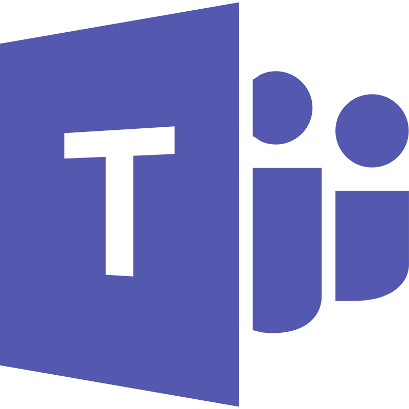

# Ferramentas Utilizadas

## Introdução

Diversas ferramentas foram utilizadas para o desenvolvimento dessa etapa do projeto da disciplina, e sua documentação se faz importante para facilitar a manutenção, garantir a reprodutibildiade e melhorar esta própria documentação.
Na **Tabela 2** abaixo, são listadas as ferramentas que nos auxiliaram nesse processo.

<b>Tabela 1:</b> Ferramentas Utilizadas

| Logo | Ferramenta | Finalidade |
| :-----: | :----: | ----------- |
|   | [GitHub](https://github.com/) | Plataforma online utilizada pra gerenciar o versionamento e o armazenamento dos documentos produzidos e hospedar a aplicação da documentação. |
|   | [Git](https://git-scm.com/) | Aplicação local utilizada pra gerenciar o versionamento da documentação. |
|       | [Visual Studio Code](https://code.visualstudio.com/) | IDE utilizada para edição de código dos arquivos da documentação. |
|         | [Teams](https://www.microsoft.com/pt-br/microsoft-teams/free) | Aplicação utilizada para agendar, realizar e gravar reuniões, sejam elas presenciais ou online. |
|         | [WhatsApp](https://www.whatsapp.com/) | Plataforma utilizada para a comunicação rápida e pontual do grupo. |
|         | [Canva](https://www.canva.com/) | Ferramenta utilizada para a produção dos Rich Pictures e Storyboarding. |
|     | [Youtube](https://www.youtube.com/) | Plataforma utilizada para hospedar e disponibilizar os vídeos das gravações das reuniões. |
|        | [Figma](https://www.figma.com/pt-br/) | Ferramenta utilizada para a prototipação das telas da aplicação. |
|     | [Docsify](https://docsify.js.org/#/?id=docsify) | Ferramenta utilizada para gerar o site da documentação e renderizá-lo no navegador. |
|     | [Miro](https://miro.com/app/dashboard/) | Ferramenta utilizada para a construção do mapa mental. |
|     | [When2meet](https://www.when2meet.com/) | Plataforma utilizada para a construção do heatmap de horários disponíveis do grupo. |

<b>Autor:</b> [Rafael Pereira](https://github.com/rafgpereira), 2025.

---

## Bibliografia

> GitHub. Disponível em: https://github.com/. Acesso em: 09 de abr. de 2025.  
> 
> Git. Disponível em: https://git-scm.com/. Acesso em: 09 de abr. de 2025.  
> 
> Visual Studio Code. Disponível em: https://code.visualstudio.com/. Acesso em: 09 de abr. de 2025.  
> 
> Microsoft Teams. Disponível em: https://www.microsoft.com/pt-br/microsoft-teams/free. Acesso em: 09 de abr. de 2025.  
> 
> WhatsApp. Disponível em: https://www.whatsapp.com/. Acesso em: 09 de abr. de 2025.  
> 
> Canva. Disponível em: https://www.canva.com/. Acesso em: 09 de abr. de 2025.  
> 
> YouTube. Disponível em: https://www.youtube.com/. Acesso em: 09 de abr. de 2025.  
> 
> Figma. Disponível em: https://www.figma.com/pt-br/. Acesso em: 09 de abr. de 2025.  
> 
> Docsify. Disponível em: https://docsify.js.org/#/?id=docsify. Acesso em: 09 de abr. de 2025.  
> 
> Miro. Disponível em: https://miro.com/app/dashboard/. Acesso em: 09 de abr. de 2025.  
> 
> When2meet. Disponível em: https://www.when2meet.com/. Acesso em: 09 de abr. de 2025.  

## Histórico de Versões

| Versão | Data       | Descrição                                      | Autor               | Revisor            |
|--------|------------|------------------------------------------------|---------------------|--------------------|
| 1.0    | 09/04/2025 | Criação do documento |  [Rafael Pereira](https://github.com/rafgpereira)  | [Letícia Torres](https://github.com/leticiatmartins)          |