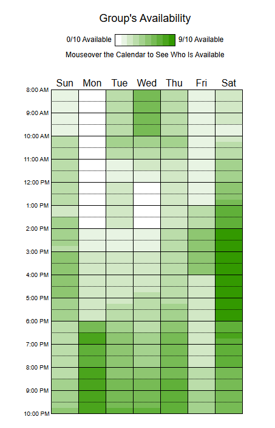

# Heatmap

## Introdução
O **Heatmap** nesse caso é uma forma visual utilizada para representar a frequência de disponibilidade ao longo da semana. Destacando os períodos mais favoráveis com cores mais intensas, facilitando assim que o grupo encontre o melhor horário e o dia para se reunirem.
### Metodologia
Para facilitar a organização das reuniões, foi utilizado o site when2meet, que basicamente é uma ferramenta simples e eficiente onde cada integrante do grupo coloca os horários que estariam disponíveis ao longo da semana, com todas as respostas é gerado um Heatmap final destacando com as cores mais fortes onde mais membros estão disponíveis nesses horários, com isso é possível escolher o melhor dia e horário para as reuniões.

**Figura 1:** Heatmap

**Autor:** [when2meet](when2meet.com), 2025.d

## Conclusão

Analisando o Heatmap de disponibilidade para reuniões do grupo, é possível identificar que os horários mais viáveis para os encontros seriam onde o verde está mais forte, isso significa que mais pessoas estariam disponíveis nesses horários facilitando assim a reunião.

Nota-se que os melhores horários para os encontros seriam nas segundas pela parte da noite ou aos sábados pela parte da tarde, que seriam os períodos onde mais pessoas estariam disponíveis.

| Versão | Data       | Descrição                                      | Autor               | Revisor            |
|--------|------------|------------------------------------------------|---------------------|--------------------|
| 1.0 | 09/04/2025 | Criação do documento | [Antônio Júnior](https://github.com/antonioleaojr)  | [Rafael Pereira](https://github.com/rafgpereira) |
| 2.0 | 09/04/2025 | Adição da imagem e análise | [Antônio Júnior](https://github.com/antonioleaojr)  | [Rafael Pereira](https://github.com/rafgpereira) |